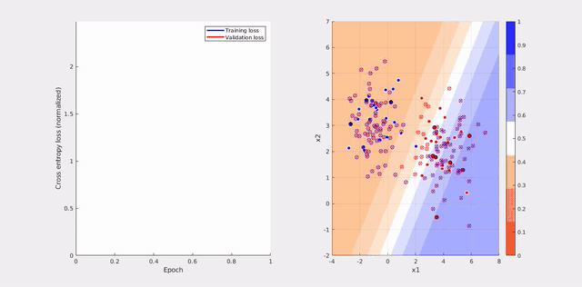

# shallow_nn

Project for Bio and Neuro Imaging class

Study of the learning behavior of a simple shallow neural network for binary classification on a dummy 2D gaussian data.

Visualisation inspired by "[A Neural Network Playground](http://playground.tensorflow.org/#activation=sigmoid&batchSize=1&dataset=gauss&regDataset=reg-plane&learningRate=0.0001&regularizationRate=0&noise=30&networkShape=&seed=0.97920&showTestData=true&discretize=false&percTrainData=70&x=true&y=true&xTimesY=false&xSquared=false&ySquared=false&cosX=false&sinX=false&cosY=false&sinY=false&collectStats=false&problem=classification&initZero=false&hideText=false)"

